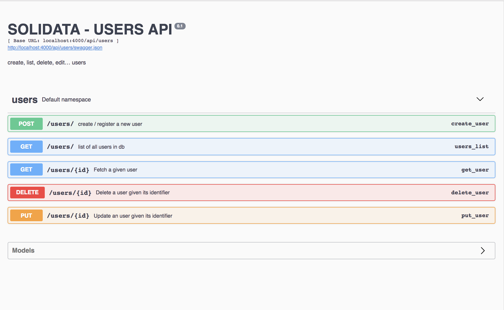

<h1 align=center>  SOLIDATA   backend</h1>

-------
## PRESENTATION

part 2a/3 of the TADATA! sofware suite (ApiViz / Solidata / OpenScraper)

A public service for managing and sharing data 

The goal : allowing you to open data from your own csv files or external APIs as simply as posible

-------

------

## TECHNICAL POINTS

#### Tech stack
- _Language_  : **Python3**... yes ... I know ... hmmm ... gnnn ... don't judge me ?
- _Framework_ : **[Flask](http://flask.pocoo.org/)**... minimalistic Python framework
- _API_       : **[Flask-RestPlus](http://flask-restplus.readthedocs.io/en/stable/)**... Swagger documentation integrated
- _Security_  : **[Flask-JWT-extended](https://flask-jwt-extended.readthedocs.io/en/latest/)**
- _Emailing_  : **[Flask-email](https://pythonhosted.org/Flask-Mail/)

#### Features
- login / register user ; 
- JSON web tokens (access and refresh) for security ; 
- confirm user by sending a confirmation link (protected) in an email ; 
- password forgotten by sending a link (protected) in an email with redirection to new password form ; 
- reset password from client interface or by sending an email with redirection to new password form... ; 
- documentation of all API endpoints with Swagger ;
