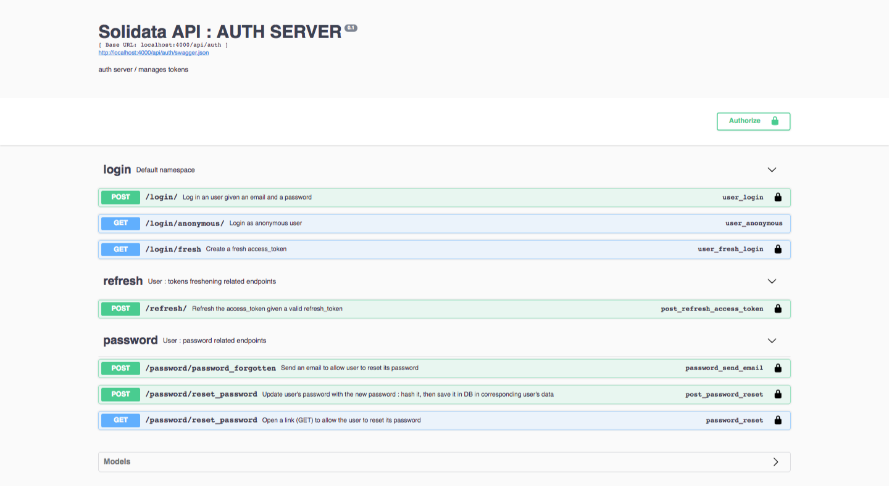

<h1 align=center>  SOLIDATA   backend</h1>

-------
## PRESENTATION

part 2a/3 of the TADATA! sofware suite ([ApiViz](https://github.com/entrepreneur-interet-general/CIS-front) / [Solidata_frontend](https://github.com/entrepreneur-interet-general/solidata_frontend) / [OpenScraper](https://github.com/entrepreneur-interet-general/OpenScraper) )

#### Building a public service for managing, consolidating, and sharing data 

-------

## GOALS

- allow you to consume data from your own csv/xls files or external APIs ;
- consolidate your data : apply your own datamodel, simplify columns, apply metadatas, ... ; 
- share the consolidated datas on API endpoints with the level of openness you decide (opendata, commons, collective, private) ;
- manage all your data and your recipes by projects ;
- be able to manage projects by teams and share data/recipes/datamodels...

------

## TECHNICAL POINTS

#### Tech stack
- _Language_  : **[Python 3.6](https://www.python.org/)**... yes ... I know ... Python again ... hmmm ... gnnn ... don't judge me ?!
- _Framework_ : **[Flask](http://flask.pocoo.org/)**... minimalistic Python framework
- _API_       : **[Flask-RestPlus](http://flask-restplus.readthedocs.io/en/stable/)**... Swagger documentation integrated
- _Security_  : **[Flask-JWT-extended](https://flask-jwt-extended.readthedocs.io/en/latest/)**... wrapper JWT for Flask
- _Emailing_  : **[Flask-email](https://pythonhosted.org/Flask-Mail/)**... templating, sending, etc...

#### Features :

- JWT (JSON Web Tokens) :
	- access and refresh token for security over all the app
- user :
	- anonymous login (automatic)
	- login / register user 
	- confirm user by sending a confirmation link (protected) in an email 
	- password forgotten by sending a link (protected) in an email with redirection to new password form 
	- reset password from client interface (protected) ...
- Documentation 
	- on all API endpoints with Swagger (and some patience from the developer)

##### Features TO DO  :
- user : 
	- edit user
	- edit email
- add/edit a project : 
	- edit project infos : licence, author, title...
	- edit team and access levels
	- add project to users involved
	- delete project
- import data : 
	- data as csv / excel sheets...
	- data as api endpoints to request... 

-------

## INSTALLATION WALKTHROUGH 

### _LOCALLY_

	__... tutorial still to do ...__

- run the app : 

`$ python appserver.py --mode=dev_email` 

------

## INSPIRATIONS / BENCHMARK

- [Dataiku](https://www.dataiku.com/), [Parabola](https://parabola.io/), but they are proprietary solutions (and too complex for our pruposes)... Not to mention they are very expensive...
- [Match ID](https://matchid-project.github.io/), but the backend doesn't resolve the "sharing" part with levels as ["opendata", "commons", "collective", "private"], and no BDD to back up recipes

-------

## CREDITS 

#### Solidata's team thanks :

- the [SocialConnect](https://entrepreneur-interet-general.etalab.gouv.fr/defi/2017/09/26/socialconnect/) project, aka "Carrefour des Innovations Sociales"
- the [EIG](https://entrepreneur-interet-general.etalab.gouv.fr/) program by [Etalab](https://www.etalab.gouv.fr/)
- the [CGET](http://www.cget.gouv.fr/)

#### Contacts - maintainance :

- [Julien Paris](<mailto:julien.paris@cget.gouv.fr>), developer (aka [JPy](https://twitter.com/jparis_py) on Twitter)

-------

## SCREENSHOTS

-------

-------

-------

-------

